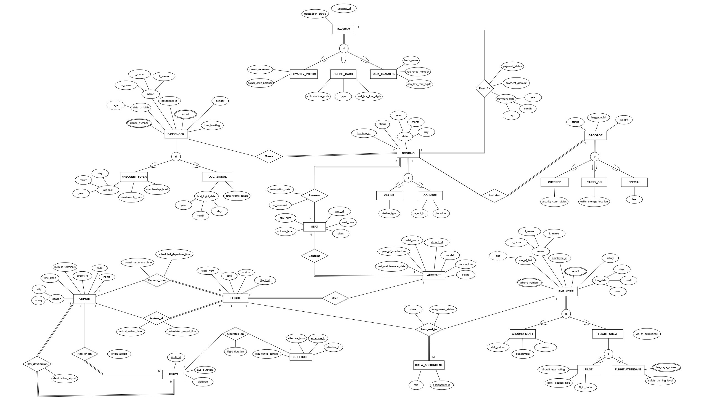

<h1 align="center" style="font-family: 'Brush Script MT', cursive; font-weight:bold; background: linear-gradient(to right, #4DA3FF, #1F8FFF, #9AD0FF); -webkit-background-clip: text; color: transparent; font-size:60px;">
  Airline Management System
</h1>

<p align="center">
  <i>A modular, 4-schema relational database architected for high-scale airline operations and automated business logic.</i>
</p>

---

### 🛠️ Tech Stack

<p align="left">
   
  &nbsp;&nbsp;&nbsp;&nbsp;
  
</p>

## 🏗️ Database Architecture

The system is organized into **four specialized schemas** to ensure data isolation, security, and optimized query performance:

- **`core`**: Manages the physical infrastructure—Airports, Aircraft fleet, Routes, and real-time Flight scheduling.
- **`crew`**: Handles the human capital—Employee profiles, Pilot ratings, and complex Crew-to-Flight assignments.
- **`customer`**: Manages the passenger experience—Profiles, Bookings, and real-time Baggage tracking.
- **`financial`**: Secures all revenue streams—Payments, Credit Card authorizations, and Loyalty Point transactions.

## 📊 System Design (ERD)

<p align="left">
  <a href="docs/erd.pdf">
    
  </a>
  <br>
  <i>Full high-resolution architecture available in the <code>/docs</code> folder</i>
</p>

## ⚡ Engineering Highlights & Business Logic

This project goes beyond simple tables by implementing automated business rules via **T-SQL**:

- **Automated Status Tracking**: Implemented Triggers (e.g., `Update_Passenger_Booking_Status`) that automatically update passenger states upon successful reservations.
- **Operational Constraints**: Hard-coded logic to ensure Pilots only fly aircraft they are rated for and that no crew member is double-booked.
- **Advanced Analytics**: Custom Stored Procedures like `Get_Flight_With_High_Avg_Distance` identify high-utilization routes using complex aggregations and subqueries.
- **Data Integrity**: Enforced strict baggage policies (max 3 bags) and financial verification requirements at the schema level.

## 📂 Project Structure

```text
├── /docs            # EERD Diagrams, Business Requirements, and Documentation
├── /sql-scripts     # Full T-SQL scripts (Schemas, Tables, Triggers, Procedures)
└── README.md        # Technical Overview
```
